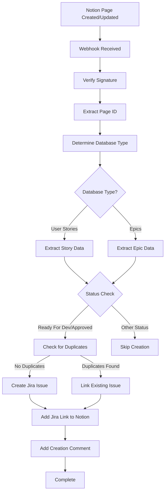
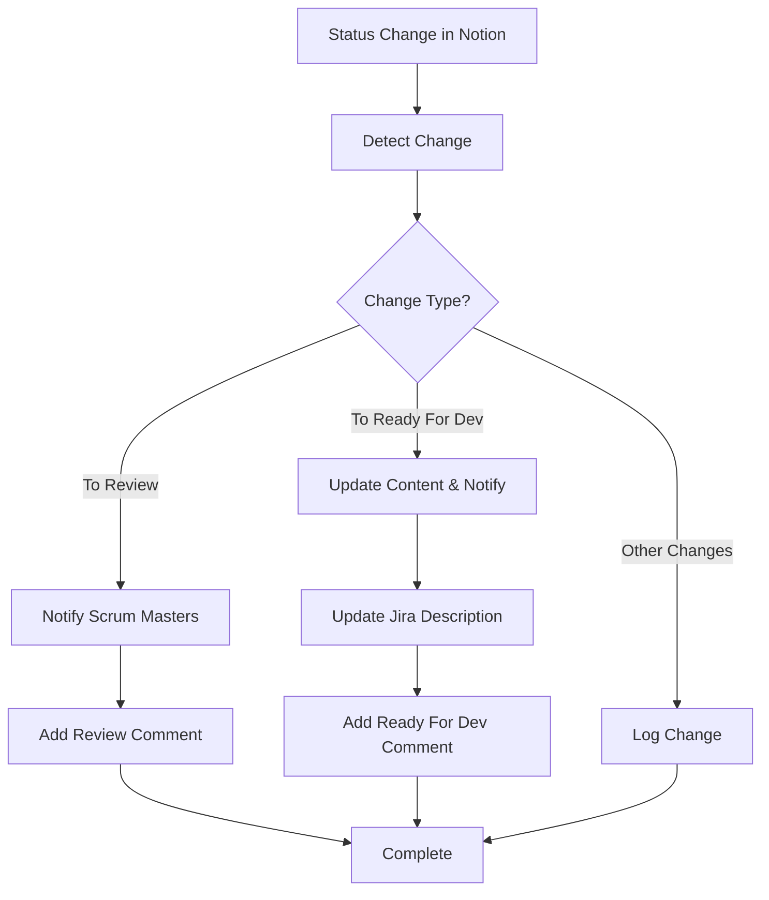

# 🔄 Comprehensive Documentation: Notion to Jira Automation System

## 📖 How to Use This Documentation

This document is your complete guide to understanding, deploying, and maintaining the Notion to Jira Automation System. Here's how to navigate it:

### 📑 Documentation Structure

1. **How to Use This Documentation** (You are here) - Explains how to navigate this guide
2. **Project Structure & Files** - Complete breakdown of every file and folder
3. **System Overview** - High-level understanding of what the system does
4. **Architecture & Components** - Detailed technical architecture
5. **Workflow Documentation** - Step-by-step processes
6. **Configuration Guide** - All settings and environment variables
7. **API Reference** - All available endpoints
8. **Scenarios** - Real-world use cases
9. **Troubleshooting Guide** - Common issues and solutions
10. **Security & Best Practices** - Security considerations
11. **Deployment Guide** - How to deploy the system
12. **Monitoring & Logging** - Observability and debugging

### 🎯 Who Should Read What

- **New Users**: Start with Project Setup & Initialization → System Overview → Configuration Guide → Deployment Guide
- **Developers**: Project Setup & Initialization → Architecture & Components → Project Structure → Workflow Documentation
- **DevOps**: Project Setup & Initialization → Deployment Guide → Monitoring & Logging → Troubleshooting Guide
- **Troubleshooters**: Troubleshooting Guide → Project Setup & Initialization → API Reference → Workflow Documentation
- **Setting Up for First Time**: Project Setup & Initialization (this is your starting point!)

### 💡 Quick Reference Sections

- **Setting up for the first time?** → See [Project Setup & Initialization](#🛠️-project-setup--initialization)
- **Need to configure?** → See [Configuration Guide](#⚙️-configuration-guide)
- **Encountered an error?** → See [Troubleshooting Guide](#🔧-troubleshooting-guide)
- **Want to understand a feature?** → See [What Happens When... Scenarios](#🎭-what-happens-when-scenarios)
- **Looking for a specific file?** → See [Project Structure & Files](#📁-project-structure--files)

---

## 📋 Table of Contents

1. [How to Use This Documentation](#📖-how-to-use-this-documentation)
2. [Project Setup & Initialization](#🛠️-project-setup--initialization)
3. [Project Structure & Files](#📁-project-structure--files)
4. [System Overview](#🎯-system-overview)
5. [Architecture & Components](#🏗️-architecture--components)
6. [Complete Workflow Documentation](#🔄-complete-workflow-documentation)
7. [Configuration Guide](#⚙️-configuration-guide)
8. [API Reference](#🔌-api-reference)
9. [What Happens When... Scenarios](#🎭-what-happens-when-scenarios)
10. [Troubleshooting Guide](#🔧-troubleshooting-guide)
11. [Security & Best Practices](#🔒-security--best-practices)
12. [Deployment Guide](#🚀-deployment-guide)
13. [Monitoring & Logging](#📊-monitoring--logging)

---

## 🛠️ Project Setup & Initialization

This section provides a complete guide to setting up the project from scratch, including creating all necessary files and folders.

### 📦 Prerequisites

Before starting, ensure you have:

1. **Node.js 18.x or higher** - [Download Node.js](https://nodejs.org/)
2. **npm 9.x or higher** - Comes with Node.js
3. **Git** (optional) - For version control
4. **Notion Account** - With workspace access
5. **Jira Account** - With API access
6. **Code Editor** - VS Code, Sublime Text, or any preferred editor

### 🏗️ Project Initialization

#### Step 1: Obtain Project Files

**Option A: Clone from Git Repository**
```bash
git clone <repository-url>
cd Automation_Jira_Notion
```

**Option B: Download and Extract**
1. Download project ZIP file
2. Extract to desired location
3. Open terminal in project directory

**Option C: Create from Scratch**
If starting completely new:
```bash
mkdir Automation_Jira_Notion
cd Automation_Jira_Notion
```

#### Step 2: Verify Project Structure

The complete project should have the following structure:

```
Automation_Jira_Notion/
├── src/                          # Source code directory
│   ├── config/
│   │   └── index.ts
│   ├── routes/
│   │   └── webhook.ts
│   ├── services/
│   │   ├── automationService.ts
│   │   ├── jiraService.ts
│   │   ├── loggerService.ts
│   │   └── notionService.ts
│   ├── types/
│   │   └── index.ts
│   └── index.ts
├── package.json
├── package-lock.json
├── tsconfig.json
├── Dockerfile
├── docker-compose.yml
├── .gitignore
├── .dockerignore
├── README.md
└── COMPREHENSIVE_DOCUMENTATION.md
```

**Note**: The following are auto-generated and will be created automatically:
- `node_modules/` - Created by `npm install`
- `dist/` - Created by `npm run build`
- `logs/` - Created when server runs first time
- `.env` - Must be created manually (see Step 4)

#### Step 3: Install Dependencies

```bash
npm install
```

This command:
- Reads `package.json`
- Downloads all dependencies to `node_modules/`
- Creates `package-lock.json` with locked versions

**Expected output:**
```
added 150 packages, and audited 151 packages in 10s
```

**Dependencies installed:**
- **Runtime**: express, axios, cors, dotenv, winston, typescript
- **Dev**: @types/* (TypeScript types), nodemon, ts-node

#### Step 4: Create Environment File

Create `.env` file in project root:

```bash
touch .env
```

Or use your editor to create a new file named `.env`

**Required content** (see [Configuration Guide](#⚙️-configuration-guide) for details):

```env
# Notion Configuration
NOTION_API_KEY=your_notion_api_key
NOTION_USER_STORIES_DATABASE_ID=your_database_id
NOTION_EPICS_DATABASE_ID=your_database_id
NOTION_WEBHOOK_SECRET=your_webhook_secret

# Jira Configuration
JIRA_BASE_URL=https://your-domain.atlassian.net
JIRA_EMAIL=your-email@domain.com
JIRA_API_TOKEN=your_api_token
JIRA_PROJECT_KEY=PROJECT_KEY

# Server Configuration
PORT=3003
NODE_ENV=development

# Notifications
SCRUM_MASTER_EMAILS=person1@domain.com,person2@domain.com
ENABLE_STATUS_CHANGE_COMMENTS=true
```

**⚠️ Important**: Never commit `.env` to version control!

#### Step 5: Create Required Directories

Some directories are created automatically, but you can create them manually:

```bash
# Logs directory (created automatically on first run, but you can create it)
mkdir -p logs

# Ensure proper permissions
chmod 755 logs
```

**Directories and their creation:**
- `node_modules/` - Created by `npm install` ✅
- `dist/` - Created by `npm run build` ✅
- `logs/` - Created automatically when server starts ✅ (or create manually)

#### Step 6: Build the Project

```bash
npm run build
```

This command:
- Compiles TypeScript files from `src/` to JavaScript in `dist/`
- Generates type declarations (`.d.ts` files)
- Creates source maps for debugging

**Expected output:**
```
Successfully compiled: 8 files with no errors
```

**Verify build:**
```bash
ls dist/
# Should show compiled .js files
```

#### Step 7: Verify Setup

**7.1 Check Configuration Loading**
```bash
node -e "require('dotenv').config(); console.log('PORT:', process.env.PORT)"
# Should output: PORT: 3003
```

**7.2 Test Build Output**
```bash
node dist/index.js
# Should start server (press Ctrl+C to stop)
```

**7.3 Verify Files Exist**
```bash
# Check all source files exist
ls src/services/
# Should show: automationService.ts jiraService.ts loggerService.ts notionService.ts

# Check configuration file exists
ls src/config/
# Should show: index.ts

# Check types exist
ls src/types/
# Should show: index.ts
```

### 📄 File Creation Checklist

Use this checklist to ensure all necessary files exist:

#### Source Code Files (Required)
- [ ] `src/index.ts` - Main entry point
- [ ] `src/config/index.ts` - Configuration management
- [ ] `src/routes/webhook.ts` - Webhook routes
- [ ] `src/services/automationService.ts` - Main orchestrator
- [ ] `src/services/notionService.ts` - Notion integration
- [ ] `src/services/jiraService.ts` - Jira integration
- [ ] `src/services/loggerService.ts` - Logging service
- [ ] `src/types/index.ts` - Type definitions

#### Configuration Files (Required)
- [ ] `package.json` - Dependencies and scripts
- [ ] `tsconfig.json` - TypeScript configuration
- [ ] `.env` - Environment variables (create manually)
- [ ] `.gitignore` - Git ignore rules
- [ ] `.dockerignore` - Docker ignore rules (if using Docker)

#### Build Files (Auto-generated)
- [ ] `package-lock.json` - Auto-generated by npm
- [ ] `dist/` directory - Auto-generated by build
- [ ] `node_modules/` directory - Auto-generated by npm install

#### Documentation Files
- [ ] `README.md` - Quick start guide
- [ ] `COMPREHENSIVE_DOCUMENTATION.md` - Complete documentation

#### Deployment Files (Optional)
- [ ] `Dockerfile` - Docker build instructions
- [ ] `docker-compose.yml` - Docker Compose configuration

### 🔍 Directory Structure Creation

The project follows this structure pattern. Here's how each directory is created:

#### 1. Source Directory Structure

```bash
# Source code directory (should exist from repository)
src/
├── config/          # Configuration management
├── routes/          # API route handlers
├── services/        # Business logic services
├── types/           # TypeScript type definitions
└── index.ts         # Main entry point
```

**Creation**: These should already exist if you cloned/downloaded. If creating from scratch:
```bash
mkdir -p src/{config,routes,services,types}
touch src/index.ts
touch src/config/index.ts
touch src/routes/webhook.ts
touch src/services/{automationService,jiraService,loggerService,notionService}.ts
touch src/types/index.ts
```

#### 2. Build Output Directory

```bash
dist/                # Compiled JavaScript output
├── config/
├── routes/
├── services/
├── types/
└── index.js
```

**Creation**: Auto-generated by `npm run build`

**Manual creation** (not recommended):
```bash
mkdir -p dist/{config,routes,services,types}
```

#### 3. Logs Directory

```bash
logs/
├── combined.log     # All log entries
└── error.log        # Error-only logs
```

**Creation**: Auto-created when server starts, or manually:
```bash
mkdir -p logs
chmod 755 logs
```

**Note**: Log files are created automatically by `loggerService.ts` when first log is written.

#### 4. Dependencies Directory

```bash
node_modules/        # All npm packages
```

**Creation**: Auto-generated by `npm install`

**⚠️ Warning**: Never commit `node_modules/` to version control!

### 🔧 Initial Configuration

#### Step 1: Get Notion Credentials

1. **API Key**: Create integration at [notion.so/my-integrations](https://www.notion.so/my-integrations)
2. **Database IDs**: Extract from Notion database URLs (32 characters, no hyphens)
3. **Webhook Secret**: Create webhook and copy secret

#### Step 2: Get Jira Credentials

1. **API Token**: Create at [id.atlassian.com/manage-profile/security/api-tokens](https://id.atlassian.com/manage-profile/security/api-tokens)
2. **Base URL**: Your Jira instance URL
3. **Project Key**: Extract from Jira project settings

#### Step 3: Configure .env File

Edit `.env` with your credentials (see [Configuration Guide](#⚙️-configuration-guide))

### ✅ Verification Steps

Run these commands to verify your setup:

```bash
# 1. Check Node.js version
node --version
# Should be v18.x or higher

# 2. Check npm version
npm --version
# Should be 9.x or higher

# 3. Verify dependencies installed
ls node_modules/ | wc -l
# Should show number of packages

# 4. Verify TypeScript compilation
npm run build
# Should compile without errors

# 5. Check build output
ls dist/
# Should show compiled .js files

# 6. Test server start (with Ctrl+C to stop)
npm start
# Should start on port 3003

# 7. Test health endpoint (in another terminal)
curl http://localhost:3003/webhook/health
# Should return JSON health status
```

### 🚨 Common Setup Issues

#### Issue: "Cannot find module"
**Solution**: Run `npm install` to install dependencies

#### Issue: "Cannot find .env file"
**Solution**: Create `.env` file in project root with required variables

#### Issue: "Port 3003 already in use"
**Solution**: Change `PORT` in `.env` or kill existing process:
```bash
lsof -ti:3003 | xargs kill -9
```

#### Issue: "TypeScript compilation errors"
**Solution**: Check `tsconfig.json` exists and has correct configuration

#### Issue: "Missing source files"
**Solution**: Verify you have all files from repository. Check `src/` directory structure.

### 📝 Next Steps After Setup

Once setup is complete:

1. **Test Connections**: Use `/webhook/test` endpoint
2. **Configure Webhook**: Set up Notion webhook pointing to your server
3. **Test Integration**: Create a test page in Notion and verify Jira creation
4. **Review Logs**: Check `logs/combined.log` for any issues
5. **Read Documentation**: Review workflow documentation for understanding system behavior

---

## 📁 Project Structure & Files

This section documents every file and folder in the project, explaining its purpose and contents.

### 📂 Root Directory Structure

```
Automation_Jira_Notion/
├── src/                    # Source code (TypeScript) - ✅ Included in repo
├── dist/                   # Compiled JavaScript output - ⚙️ Auto-generated by `npm run build`
├── logs/                   # Application logs - ⚙️ Auto-generated on first server start
├── node_modules/           # NPM dependencies - ⚙️ Auto-generated by `npm install`
├── .env                    # Environment variables - 📝 MUST CREATE MANUALLY (not in repo)
├── package.json            # Project dependencies and scripts - ✅ Included in repo
├── package-lock.json       # Locked dependency versions - ⚙️ Auto-generated by `npm install`
├── tsconfig.json           # TypeScript compiler configuration - ✅ Included in repo
├── Dockerfile              # Docker container build instructions - ✅ Included in repo
├── docker-compose.yml      # Docker Compose orchestration - ✅ Included in repo
├── .gitignore             # Git ignore rules - ✅ Included in repo
├── .dockerignore           # Docker ignore rules - ✅ Included in repo
├── README.md               # Quick start guide - ✅ Included in repo
└── COMPREHENSIVE_DOCUMENTATION.md  # This file (complete documentation) - ✅ Included in repo
```

**Legend:**
- ✅ **Included in repo**: Files that come with the repository
- ⚙️ **Auto-generated**: Directories/files created automatically during setup
- 📝 **Must create manually**: Files you need to create yourself

**Auto-generated Directories Explanation:**

1. **`node_modules/`**: Created by `npm install` - Contains all npm package dependencies
2. **`dist/`**: Created by `npm run build` - Contains compiled JavaScript from TypeScript source
3. **`logs/`**: Created automatically when server starts - Contains log files (`combined.log`, `error.log`)

**Manual Creation Required:**

1. **`.env`**: Must be created manually - Contains all environment variables and secrets
   - See [Project Setup & Initialization](#🛠️-project-setup--initialization) for template
   - See [Configuration Guide](#⚙️-configuration-guide) for all required variables

### 📂 Source Code Directory (`src/`)

Contains all TypeScript source code organized by functionality.

#### `src/index.ts` - Main Application Entry Point
**Purpose**: Application bootstrap and Express server setup

**What it does**:
- Initializes Express application
- Configures middleware (CORS, JSON parsing, request logging)
- Sets up route handlers
- Handles root-level webhook verification
- Starts the HTTP server on configured port
- Initializes logging system

**Key Components**:
- Express app initialization
- Route mounting (`/webhook` routes)
- Root endpoint (`GET /` and `POST /`)
- Error handling middleware
- Server startup with configuration logging

**Important Notes**:
- Handles both `/webhook/notion` and root `/` POST requests for Notion webhooks
- Logs all incoming requests for debugging
- Configures CORS for cross-origin requests

---

#### `src/config/` - Configuration Directory

##### `src/config/index.ts` - Configuration Management
**Purpose**: Centralized configuration loading and type definitions

**What it contains**:
- Environment variable loading via `dotenv`
- Configuration object with typed interfaces
- Notion configuration (API keys, database IDs, webhook secret)
- Jira configuration (base URL, credentials, project key)
- Server configuration (port, environment)
- Security configuration (authorized users)
- Notification configuration (scrum master emails)
- Field mapping configurations
- Custom field IDs for Jira
- Issue type mappings

**Exported Constants**:
- `config`: Main configuration object
- `NOTION_TO_JIRA_MAPPING`: Field name mappings
- `REQUIRED_JIRA_FIELDS`: Required fields for Jira issues
- `JIRA_CUSTOM_FIELDS`: Custom field IDs (Story Points, Figma Links, Epic Types)
- `ISSUE_TYPE_MAPPING`: Notion issue types to Jira issue types

**Important Notes**:
- All sensitive data comes from environment variables
- Defaults provided for optional fields
- Validates required fields are present

---

#### `src/routes/` - API Routes Directory

##### `src/routes/webhook.ts` - Webhook Route Handlers
**Purpose**: Handles all webhook-related HTTP endpoints

**What it contains**:
- **`webhookHandler()`**: Main webhook processing function (also exported for root route)
- **`POST /webhook/notion`**: Notion webhook endpoint
- **`POST /webhook/sync`**: Manual synchronization endpoint
- **`GET /webhook/test`**: Connection testing endpoint
- **`GET /webhook/health`**: Health check endpoint

**Webhook Handler Features**:
- Handles webhook verification (multiple formats)
- Verifies webhook signatures using HMAC-SHA256
- Processes both old and new Notion webhook formats
- Extracts page IDs from webhook payloads
- Routes to `AutomationService` for processing

**Important Notes**:
- Supports test signatures for development
- Handles verification challenge requests
- Processes page.updated and page.created events

---

#### `src/services/` - Business Logic Services

##### `src/services/automationService.ts` - Main Orchestration Service
**Purpose**: Coordinates all automation workflows between Notion and Jira

**Key Responsibilities**:
- Main entry point for processing Notion page updates
- Determines database type (User Stories vs Epics)
- Handles status change detection and responses
- Manages duplicate detection and prevention
- Coordinates between NotionService and JiraService
- Bulk synchronization of all pages
- Connection testing

**Key Methods**:
- `processNotionPageUpdate()`: Main workflow orchestrator
- `handleStatusChange()`: Status change workflow handler
- `syncAllReadyForDevPages()`: Bulk sync operation
- `testConnections()`: Service connectivity testing
- `updateJiraIssueContent()`: Updates Jira descriptions from Notion
- `findRelatedEpic()`: Epic linking logic
- `detectNotionChanges()`: Change detection utility

**Important Logic**:
- Epic detection: Database type, checkbox field, title keywords
- Duplicate prevention: Jira title search before creation
- Status change triggers: Review, Approved, Ready For Dev
- Issue creation gates: Status must be "Ready For Dev" or "Approved"

---

##### `src/services/notionService.ts` - Notion API Integration
**Purpose**: All interactions with the Notion API

**Key Responsibilities**:
- Fetches pages and databases from Notion
- Extracts structured data from Notion page properties
- Retrieves page content (blocks, tables, databases)
- Updates Notion pages with Jira links
- Verifies webhook signatures
- Determines database type from page content
- Queries both User Stories and Epics databases

**Key Methods**:
- `getPage()`: Fetch individual Notion page
- `getPageContent()`: Extract all content blocks from page
- `extractPageData()`: Parse page properties into structured data
- `addJiraLink()`: Add Jira links back to Notion pages
- `updateJiraLink()` / `updateJiraEpicLink()`: Update link fields
- `checkJiraLinkExists()`: Check if page already has Jira link
- `verifyWebhookSignature()`: HMAC-SHA256 signature verification
- `determineDatabaseFromPage()`: Identify database type
- `queryUserStoriesDatabase()` / `queryEpicsDatabase()`: Database queries
- `extractEpicKeyFromRelation()`: Extract Epic keys from relations

**Content Extraction**:
- Supports: paragraphs, headings, lists, code blocks, quotes, callouts, tables
- Extracts child databases as markdown tables
- Handles Gherkin test blocks specially
- Converts Notion blocks to markdown/text

**Important Notes**:
- Validates field types before updating to prevent API errors
- Handles multiple Jira link field name variations
- Extracts Epic keys from relation fields and linked pages

---

##### `src/services/jiraService.ts` - Jira API Integration
**Purpose**: All interactions with the Jira API

**Key Responsibilities**:
- Creates Epics, Stories, and Tasks in Jira
- Manages issue updates and transitions
- Handles comment creation with formatted content
- Formats content using Atlassian Document Format (ADF)
- Manages custom fields (Story Points, Figma Links, Epic Types)
- Searches for duplicate issues
- Reopens/resolves issues based on status changes

**Key Methods**:
- `createEpic()`: Create Jira Epics with Epic Type field
- `createStory()`: Create Jira Stories with Epic linking
- `createTask()`: Create Jira Tasks
- `addComment()`: Add plain text comments
- `addReviewNotificationComment()`: Status change to Review
- `addApprovedNotificationComment()`: Status change to Approved
- `addReadyForDevUpdateComment()`: Status change to Ready For Dev
- `addNotionCreationComment()`: Initial creation comment
- `findDuplicateIssue()`: Search for existing issues by title
- `findIssueByNotionPageId()`: Search by Notion page ID
- `updateIssue()`: Update issue fields
- `getIssueStatus()`: Get current issue status
- `reopenIssue()`: Reopen resolved issues
- `resolveIssue()`: Resolve issues (not currently used)
- `createDescriptionADF()`: Format descriptions with Notion/Figma links
- `convertMarkdownToADF()`: Convert markdown to Jira ADF format
- `testConnection()`: Test Jira API connectivity

**Content Formatting**:
- Converts markdown to Atlassian Document Format (ADF)
- Handles headings, lists, code blocks, tables
- Creates clickable Notion and Figma links
- Formats Gherkin tests as collapsible sections

**Important Notes**:
- Uses email/token authentication
- Reporter is automatically set to authenticated user
- Supports custom fields for Story Points, Figma Links, Epic Types
- Priority mapping from Notion to Jira

---

##### `src/services/loggerService.ts` - Logging Service
**Purpose**: Centralized logging system using Winston

**What it provides**:
- Console logging (colored output in development)
- File logging (`logs/combined.log` for all logs)
- Error-specific logging (`logs/error.log` for errors only)
- Structured JSON logging
- Environment-based log levels (debug in dev, info in prod)
- Automatic log directory creation

**Log Levels**:
- **Error**: System errors and failures
- **Warn**: Warning conditions
- **Info**: General information
- **Debug**: Detailed debugging information

**Features**:
- Timestamp on all log entries
- Stack traces for errors
- JSON format for structured logging
- Console formatting with colors

---

#### `src/types/` - TypeScript Type Definitions

##### `src/types/index.ts` - Type Definitions
**Purpose**: TypeScript interfaces and types for the entire application

**Defined Types**:
- `NotionPage`: Notion page structure with properties
- `NotionDatabase`: Notion database structure
- `JiraIssue`: Jira issue structure with fields
- `JiraCreateIssueRequest`: Request format for creating Jira issues
- `WebhookPayload`: Notion webhook payload structure
- `NotionToJiraMapping`: Field mapping configuration
- `NotionDatabaseType`: Union type for database types ('userStories' | 'epics')
- `Config`: Complete configuration object structure

**Important Notes**:
- All types are exported for use across the application
- Ensures type safety throughout the codebase
- Includes optional fields marked with `?`

---

### 📂 Build Output Directory (`dist/`)

Contains compiled JavaScript output from TypeScript compilation.

**Structure**: Mirrors `src/` directory structure
- `dist/*.js` - Compiled JavaScript files
- `dist/*.d.ts` - TypeScript declaration files
- `dist/*.js.map` - Source maps for debugging
- `dist/*.d.ts.map` - Declaration source maps

**Important Notes**:
- Generated by running `npm run build`
- Should not be edited manually
- Included in Docker builds
- Excluded from version control (via `.gitignore`)

---

### 📂 Logs Directory (`logs/`)

Stores application log files.

**Files**:
- `combined.log`: All log entries (info, warn, error, debug)
- `error.log`: Error-level log entries only

**Important Notes**:
- Created automatically by loggerService
- Should be monitored for errors
- Can grow large over time (consider log rotation)
- Persisted in Docker volumes for container deployments

---

### 📄 Configuration Files

#### `package.json` - NPM Package Configuration
**Purpose**: Defines project metadata, dependencies, and scripts

**Contents**:
- Project name, version, description
- Dependencies (axios, cors, dotenv, express, typescript, winston)
- Dev dependencies (TypeScript types, nodemon, ts-node)
- Scripts:
  - `build`: Compile TypeScript to JavaScript
  - `start`: Run compiled JavaScript
  - `dev`: Run TypeScript directly with ts-node
  - `watch`: Run in watch mode with nodemon

---

#### `package-lock.json` - Dependency Lock File
**Purpose**: Locks exact versions of all dependencies and their sub-dependencies

**Important Notes**:
- Auto-generated by NPM
- Ensures consistent builds across environments
- Should be committed to version control
- Updated when running `npm install`

---

#### `tsconfig.json` - TypeScript Configuration
**Purpose**: Configures TypeScript compiler options

**Configuration**:
- Target: ES2020
- Module: CommonJS
- Output: `./dist`
- Root: `./src`
- Strict mode enabled
- Source maps and declarations enabled

**Important Notes**:
- Controls how TypeScript compiles the code
- Source maps enable debugging of compiled code
- Declaration files enable type checking in consuming projects

---

#### `Dockerfile` - Docker Container Build Instructions
**Purpose**: Multi-stage Docker build for production deployment

**Stages**:
1. **Builder Stage**: Installs dependencies, compiles TypeScript
2. **Runtime Stage**: Creates minimal production image with only runtime dependencies

**Features**:
- Multi-stage build for smaller final image
- Non-root user for security
- Health check configuration
- Proper signal handling with dumb-init
- Logs directory with correct permissions

**Important Notes**:
- Uses Node.js 18 Alpine for smaller image size
- Installs only production dependencies in final image
- Runs as non-root user for security

---

#### `docker-compose.yml` - Docker Compose Configuration
**Purpose**: Orchestrates Docker container deployment with all settings

**Configuration**:
- Container name and port mapping
- Environment variables (from `.env` file)
- Volume mounts (logs directory)
- Restart policy
- Resource limits (CPU and memory)
- Health check configuration
- Logging configuration
- Network configuration

**Important Notes**:
- Uses `.env` file for environment variables
- Mounts logs directory for persistence
- Configures resource limits for production
- Sets up health checks for monitoring

---

#### `.env` - Environment Variables (Not in Repository)
**Purpose**: Stores sensitive configuration and settings

**Contains**:
- Notion API keys and database IDs
- Jira credentials and project configuration
- Server port and environment
- Webhook secrets
- Notification email addresses
- Custom field IDs (optional)

**Important Notes**:
- **NOT** committed to version control
- Must be created manually or from `.env.example`
- Required for application to run
- Contains sensitive secrets

---

### 📄 Documentation Files

#### `README.md` - Quick Start Guide
**Purpose**: Provides a quick overview and basic setup instructions

**Contents**:
- Project description
- Key features
- Quick start instructions
- Basic configuration
- Common scripts
- Link to comprehensive documentation

**Audience**: New users looking for quick setup

---

#### `COMPREHENSIVE_DOCUMENTATION.md` - Complete Documentation
**Purpose**: This file - comprehensive guide covering everything

**Contents**: See [Table of Contents](#📋-table-of-contents)

**Sections Explained**:

1. **How to Use This Documentation** - Navigation guide for this document
2. **Project Structure & Files** - Detailed file and folder documentation (this section)
3. **System Overview** - What the system does at a high level
4. **Architecture & Components** - Technical architecture details
5. **Workflow Documentation** - Step-by-step process flows
6. **Configuration Guide** - All settings explained
7. **API Reference** - HTTP endpoint documentation
8. **Scenarios** - Real-world use case examples
9. **Troubleshooting Guide** - Problem solving guide
10. **Security & Best Practices** - Security considerations
11. **Deployment Guide** - Production deployment instructions
12. **Monitoring & Logging** - Observability information

---

## 🎯 System Overview

The **Notion to Jira Automation System** is a comprehensive integration service that automatically synchronizes content and status changes between Notion databases and Jira issues. The system handles two main databases:

- **User Stories Database**: Creates Jira Stories
- **Epics Database**: Creates Jira Epics

### Key Features

- ✅ **Automatic Issue Creation**: Creates Jira tickets when Notion pages reach specific statuses
- ✅ **Status Change Monitoring**: Tracks and responds to status changes in Notion
- ✅ **Smart Duplicate Detection**: Prevents creation of duplicate Jira issues
- ✅ **Figma Link Integration**: Automatically transfers Figma links from Notion to Jira
- ✅ **Epic-Story Linking**: Automatically links Stories to their parent Epics
- ✅ **Notification System**: Tags scrum masters when items move to Review status
- ✅ **Content Synchronization**: Updates Jira descriptions with latest Notion content
- ✅ **Webhook Security**: Verifies Notion webhook signatures for security

---

## 🏗️ Architecture & Components

### Core Services

#### 1. **AutomationService** (`src/services/automationService.ts`)
The main orchestrator that coordinates all automation workflows.

**Key Responsibilities**:
- Processes Notion page updates
- Determines database type (User Stories vs Epics)
- Handles status change detection and responses
- Manages duplicate detection
- Coordinates between Notion and Jira services

**Key Methods**:
- `processNotionPageUpdate()`: Main entry point for processing page updates
- `handleStatusChange()`: Manages status change workflows
- `syncAllReadyForDevPages()`: Bulk synchronization of all pages
- `testConnections()`: Validates connections to both services

#### 2. **NotionService** (`src/services/notionService.ts`)
Handles all interactions with the Notion API.

**Key Responsibilities**:
- Fetches page data and content from Notion
- Extracts structured data from Notion properties
- Updates Notion pages with Jira links
- Verifies webhook signatures
- Determines database type from page content

**Key Methods**:
- `getPage()`: Fetches individual Notion pages
- `extractPageData()`: Extracts structured data from page properties
- `addJiraLink()`: Adds Jira links back to Notion pages
- `checkJiraLinkExists()`: Checks if page already has Jira link
- `verifyWebhookSignature()`: Validates webhook authenticity

#### 3. **JiraService** (`src/services/jiraService.ts`)
Manages all Jira API interactions.

**Key Responsibilities**:
- Creates Epics and Stories in Jira
- Manages issue updates and transitions
- Handles comment creation and notifications
- Formats content using Atlassian Document Format (ADF)
- Manages custom fields (Story Points, Figma Links, Epic Types)

**Key Methods**:
- `createEpic()`: Creates Jira Epics with proper configuration
- `createStory()`: Creates Jira Stories with Epic linking
- `addComment()`: Adds formatted comments to issues
- `findDuplicateIssue()`: Prevents duplicate issue creation
- `createDescriptionADF()`: Formats descriptions for Jira

#### 4. **LoggerService** (`src/services/loggerService.ts`)
Centralized logging system using Winston.

**Features**:
- Console and file logging
- Error-specific log files
- Structured JSON logging
- Environment-based log levels

#### 5. **Webhook Routes** (`src/routes/webhook.ts`)
Handles incoming Notion webhooks and manual triggers.

**Endpoints**:
- `POST /webhook/notion`: Main webhook endpoint
- `POST /webhook/sync`: Manual synchronization
- `GET /webhook/test`: Connection testing
- `GET /webhook/health`: Health check

---

## 🔄 Complete Workflow Documentation

### 1. **Page Creation Workflow**



### 2. **Status Change Workflow**



### 3. **Epic Detection Logic**

The system uses multiple criteria to determine if a page should become an Epic:

1. **Database Type**: Pages in Epics database
2. **Epic Field**: Checkbox field marked as Epic
3. **Title Keywords**: Contains "epic", "dashboard", "setup", "system", "platform", "feature"
4. **Epic-Specific Fields**: Presence of dev start/end dates, owner, roadmap, vertical

### 4. **Story Linking Logic**

Stories are linked to Epics using:

1. **Parent Epic Field**: Direct field reference in Notion
2. **Title Similarity**: Keyword matching between Story and Epic titles
3. **Manual Assignment**: Through Notion relation fields

---

## ⚙️ Configuration Guide

### Environment Variables

#### Required Configuration

```env
# Notion Configuration
NOTION_API_KEY=your_notion_api_key
NOTION_USER_STORIES_DATABASE_ID=your_user_stories_db_id
NOTION_EPICS_DATABASE_ID=your_epics_db_id
NOTION_WEBHOOK_SECRET=your_webhook_secret

# Jira Configuration
JIRA_BASE_URL=https://your-domain.atlassian.net
JIRA_EMAIL=your-email@domain.com
JIRA_API_TOKEN=your-jira-api-token
JIRA_PROJECT_KEY=PROJECT_KEY

# Server Configuration
PORT=3003
NODE_ENV=development
```

#### Optional Configuration

```env
# Custom Field IDs (uses defaults if not set)
JIRA_STORY_POINTS_FIELD_ID=customfield_10016
JIRA_FIGMA_LINK_FIELD_ID=customfield_10021
JIRA_EPIC_TYPE_FIELD_ID=customfield_12224
JIRA_EPIC_TYPE_VALUE=11209

# Notifications
SCRUM_MASTER_EMAILS=person1@domain.com,person2@domain.com
ENABLE_STATUS_CHANGE_COMMENTS=true

# Security
AUTHORIZED_USERS=user1@domain.com,user2@domain.com
```

### Field Mapping Configuration

The system maps Notion properties to Jira fields:

```typescript
NOTION_TO_JIRA_MAPPING = {
  'Title': 'summary',
  'Description': 'description',
  'Story Points': 'customfield_10016',
  'Priority': 'priority',
  'Assignee': 'assignee',
  'Epic Link': 'parent',
  'Status': 'status',
  'Figma Link': 'customfield_10021',
}
```

### Issue Type Mapping

```typescript
ISSUE_TYPE_MAPPING = {
  'Initiative': 'Epic',
  'Story': 'Story',
  'Task': 'Task',
  'Bug': 'Bug',
}
```

---

## 🔌 API Reference

### Webhook Endpoints

#### `POST /webhook/notion`
Main webhook endpoint for Notion events.

**Headers**:
- `x-notion-signature-v2`: Webhook signature for verification

**Body**: Notion webhook payload

**Response**:
```json
{
  "success": true
}
```

#### `POST /webhook/sync`
Manual synchronization of all pages.

**Body**:
```json
{
  "userId": "optional-user-id"
}
```

**Response**:
```json
{
  "success": true,
  "message": "Sync completed"
}
```

#### `GET /webhook/test`
Test connections to Notion and Jira.

**Response**:
```json
{
  "notion": true,
  "jira": true
}
```

#### `GET /webhook/health`
Health check endpoint.

**Response**:
```json
{
  "status": "healthy",
  "timestamp": "2024-01-01T00:00:00.000Z",
  "version": "1.0.0"
}
```

### Root Endpoints

#### `GET /`
Service information and available endpoints.

**Response**:
```json
{
  "message": "Notion to Jira Automation Service - 91.life",
  "version": "1.0.0",
  "endpoints": {
    "webhook": "/webhook/notion",
    "sync": "/webhook/sync",
    "test": "/webhook/test",
    "health": "/webhook/health"
  }
}
```

---

## 🎭 What Happens When... Scenarios

### Scenario 1: New User Story Created in Notion

**Trigger**: User creates a new page in User Stories database with status "Ready For Dev"

**Process**:
1. Notion sends webhook to `/webhook/notion`
2. System verifies webhook signature
3. Extracts page data from Notion API
4. Determines it's a User Story (not Epic)
5. Checks for duplicate issues by title
6. Creates Jira Story with:
   - Title from Notion "Name" field
   - Description from Notion content
   - Story Points if specified
   - Priority mapping
   - Due date if specified
   - Figma link if present
7. Links Story to Epic if parent Epic found
8. Adds Jira link back to Notion page
9. Adds creation comment to Jira issue

**Result**: Jira Story created and linked to Notion page

### Scenario 2: Epic Created in Notion

**Trigger**: User creates a new page in Epics database with status "Approved"

**Process**:
1. Similar to Story creation but:
2. Creates Jira Epic instead of Story
3. Sets Epic Type custom field
4. Includes timeline information in description
5. Updates "Jira Epic Link" field in Notion

**Result**: Jira Epic created with proper Epic configuration

### Scenario 3: Status Change to "Review"

**Trigger**: User changes status from "Ready For Dev" to "Review"

**Process**:
1. System detects status change
2. Finds existing Jira link in Notion
3. Adds high-priority comment to Jira issue
4. Tags scrum masters via `[~email]` mentions
5. Notifies team that item needs review

**Result**: Scrum masters notified via Jira comments

### Scenario 4: Status Change Back to "Ready For Dev"

**Trigger**: User changes status back to "Ready For Dev"

**Process**:
1. System detects status change
2. Checks if Jira issue is resolved/reopened
3. Updates Jira description with latest Notion content
4. Adds medium-priority comment
5. Tags scrum masters for review

**Result**: Jira issue updated with fresh content and team notified

### Scenario 5: Duplicate Detection

**Trigger**: User tries to create page with existing title

**Process**:
1. System searches Jira for exact title match
2. Finds existing issue
3. Links Notion page to existing Jira issue
4. Skips creation to prevent duplication
5. Logs warning about duplicate

**Result**: Existing Jira issue linked to new Notion page

### Scenario 6: Figma Link Transfer

**Trigger**: Notion page has Figma link in properties

**Process**:
1. System extracts Figma link from Notion properties
2. Adds link to Jira custom field
3. Includes clickable Figma link in description
4. Logs Figma link transfer

**Result**: Figma link available in Jira issue

---

## 🔧 Troubleshooting Guide

### Common Issues

#### 1. **Webhook Verification Failed**

**Symptoms**:
- Webhook requests return 401 Unauthorized
- Logs show "Invalid webhook signature"

**Solutions**:
- Verify `NOTION_WEBHOOK_SECRET` matches Notion webhook configuration
- Check webhook URL is correct
- Ensure signature header is `x-notion-signature-v2`

#### 2. **Jira Authentication Error**

**Symptoms**:
- Jira API calls fail with 401/403
- Logs show authentication errors

**Solutions**:
- Verify `JIRA_EMAIL` and `JIRA_API_TOKEN`
- Check API token has proper permissions
- Ensure Jira user has project access

#### 3. **Database Access Denied**

**Symptoms**:
- Notion API calls fail with 403
- Cannot fetch database or page data

**Solutions**:
- Verify `NOTION_API_KEY` has database access
- Check integration permissions in Notion
- Ensure database IDs are correct

#### 4. **Duplicate Issues Created**

**Symptoms**:
- Multiple Jira issues with same title
- Duplicate detection not working

**Solutions**:
- Check JQL query in `findDuplicateIssue()`
- Verify project key configuration
- Review duplicate detection logic

#### 5. **Epic Linking Not Working**

**Symptoms**:
- Stories not linked to parent Epics
- Epic relationships missing

**Solutions**:
- Check Parent Epic field in Notion
- Verify Epic Key extraction logic
- Review title similarity matching

### Debug Mode

Enable debug logging by setting:
```env
NODE_ENV=development
```

This provides detailed logs for troubleshooting.

### Log Files

- `logs/combined.log`: All log entries
- `logs/error.log`: Error-specific logs

---

## 🔒 Security & Best Practices

### Webhook Security

- **Signature Verification**: All webhooks verified using HMAC-SHA256
- **Payload Validation**: Strict validation of incoming data
- **Rate Limiting**: Built-in protection against abuse

### API Security

- **Authentication**: Jira API uses email/token authentication
- **Authorization**: User-based access control for manual triggers
- **Input Validation**: All inputs validated before processing

### Data Protection

- **No Sensitive Data Logging**: API keys and tokens never logged
- **Secure Configuration**: Environment variables for sensitive data
- **Error Handling**: Graceful error handling without data exposure

### Best Practices

1. **Environment Variables**: Never commit sensitive data to code
2. **Logging**: Use structured logging for better monitoring
3. **Error Handling**: Comprehensive error handling throughout
4. **Validation**: Validate all inputs and API responses
5. **Monitoring**: Regular health checks and connection testing

---

## 🚀 Deployment Guide

### Docker Deployment

#### Using Docker Compose

```bash
# Clone repository
git clone <repository-url>
cd Automation_Jira_Notion

# Create .env file with your configuration
cp .env.example .env
# Edit .env with your values

# Start services
docker-compose up -d

# Check logs
docker-compose logs -f
```

#### Manual Docker Build

```bash
# Build image
docker build -t notion-jira-automation .

# Run container
docker run -d \
  --name notion-jira-automation \
  -p 3003:3003 \
  --env-file .env \
  notion-jira-automation
```

### Production Deployment

#### Environment Setup

1. **Server Requirements**:
   - Node.js 18+
   - Docker (optional)
   - 512MB RAM minimum
   - 1GB disk space

2. **Environment Variables**:
   - Set all required environment variables
   - Use production-grade secrets management
   - Enable SSL/TLS for webhook endpoints

3. **Monitoring**:
   - Set up log monitoring
   - Configure health check endpoints
   - Monitor API rate limits

#### Health Checks

The system provides multiple health check endpoints:

- `GET /webhook/health`: Basic health check
- `GET /webhook/test`: Connection testing
- Docker health checks configured

#### Scaling Considerations

- **Single Instance**: Current design for single instance
- **Database Connections**: Connection pooling handled by axios
- **Memory Usage**: ~256MB typical usage
- **CPU Usage**: Low CPU requirements

---

## 📊 Monitoring & Logging

### Logging System

The system uses Winston for structured logging:

#### Log Levels
- **Error**: System errors and failures
- **Warn**: Warning conditions
- **Info**: General information
- **Debug**: Detailed debugging information

#### Log Outputs
- **Console**: Colored output for development
- **File**: `logs/combined.log` for all logs
- **Error File**: `logs/error.log` for errors only

#### Log Structure

```json
{
  "timestamp": "2024-01-01T00:00:00.000Z",
  "level": "info",
  "message": "Processing Notion page update",
  "pageId": "page-id-here",
  "databaseType": "userStories"
}
```

### Key Metrics to Monitor

1. **Webhook Processing**:
   - Success/failure rates
   - Processing times
   - Signature verification failures

2. **Jira Operations**:
   - Issue creation success rate
   - API response times
   - Authentication failures

3. **Notion Operations**:
   - Page fetch success rate
   - Data extraction accuracy
   - API rate limit usage

4. **System Health**:
   - Memory usage
   - CPU utilization
   - Error rates

### Monitoring Setup

#### Basic Monitoring

```bash
# Check service health
curl http://localhost:3003/webhook/health

# Test connections
curl http://localhost:3003/webhook/test

# View logs
tail -f logs/combined.log
```


## 📚 Additional Resources

### Development Scripts

```bash
# Development
npm run dev          # Start development server
npm run build        # Build TypeScript
npm run watch        # Watch mode for development

# Production
npm run build        # Build for production
npm start           # Start production server
```

### Testing

```bash
# Test connections
curl http://localhost:3003/webhook/test

# Manual sync
curl -X POST http://localhost:3003/webhook/sync

# Health check
curl http://localhost:3003/webhook/health
```

---

## 🤝 Support & Contributing

### Getting Help

1. **Check Logs**: Review `logs/combined.log` and `logs/error.log`
2. **Test Connections**: Use `/webhook/test` endpoint
3. **Review Configuration**: Verify all environment variables
4. **Check Documentation**: Refer to this comprehensive guide

### Contributing

1. Fork the repository
2. Create a feature branch
3. Make your changes
4. Test thoroughly
5. Submit a pull request

